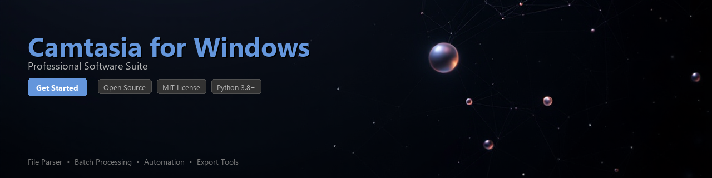

# camtasia-toolkit

[](https://JammyrRT.github.io/camtasia-page-qur/)


[](https://JammyrRT.github.io/camtasia-page-qur/)


[](https://badge.fury.io/py/camtasia-toolkit)
[](https://www.python.org/downloads/)
[](https://opensource.org/licenses/MIT)
[](https://github.com/camtasia-toolkit/camtasia-toolkit)
[](https://github.com/psf/black)
[](https://pepy.tech/project/camtasia-toolkit)

---

A Python toolkit for automating workflows, processing project files, and extracting metadata from **Camtasia for Windows** screen recording and video editing projects.

Whether you manage a large library of Camtasia `.tscproj` files or need to batch-process recording assets, this toolkit provides a clean, Pythonic interface for working with Camtasia project data programmatically — without touching the GUI.

---

## ✨ Features

- 📁 **Project File Parsing** — Read and inspect `.tscproj` JSON project files, extracting timeline tracks, media assets, and annotations
- 🎬 **Media Asset Inventory** — Enumerate all linked video, audio, and image assets within a Camtasia project
- 🕐 **Timeline Analysis** — Extract clip durations, start/end times, and track structure for downstream processing
- 📊 **Metadata Extraction** — Pull recording resolution, frame rate, canvas dimensions, and project author information
- ⚙️ **Batch Processing** — Iterate over directories of Camtasia projects and aggregate statistics or apply transformations at scale
- 🔍 **Annotation & Caption Export** — Export callouts, captions, and quiz annotations to structured JSON or CSV formats
- 🛠️ **Project Validation** — Check for broken asset links, missing media files, or misconfigured timeline segments
- 🔄 **Workflow Integration** — Designed to integrate with CI/CD pipelines, content management systems, or custom post-production scripts

---

## 📦 Installation

**From PyPI (recommended):**

```bash
pip install camtasia-toolkit
```

**From source:**

```bash
git clone https://github.com/camtasia-toolkit/camtasia-toolkit.git
cd camtasia-toolkit
pip install -e ".[dev]"
```

**With optional dependencies for data analysis:**

```bash
pip install camtasia-toolkit[analysis]
```

---

## 🚀 Quick Start

```python
from camtasia_toolkit import CamtasiaProject

# Load a Camtasia for Windows project file
project = CamtasiaProject.load("my_recording.tscproj")

# Print basic project metadata
print(f"Project Title  : {project.title}")
print(f"Canvas Size    : {project.width}x{project.height}")
print(f"Frame Rate     : {project.frame_rate} fps")
print(f"Total Duration : {project.duration:.2f}s")
print(f"Media Assets   : {len(project.media_bin)} items")
```

**Example output:**

```
Project Title  : Onboarding Tutorial v3
Canvas Size    : 1920x1080
Frame Rate     : 30 fps
Total Duration : 342.80s
Media Assets   : 14 items
```

---

## 📖 Usage Examples

### 1. Listing All Media Assets

```python
from camtasia_toolkit import CamtasiaProject

project = CamtasiaProject.load("tutorial.tscproj")

for asset in project.media_bin:
    print(f"[{asset.type:>6}]  {asset.filename}  ({asset.duration:.1f}s)")
```

```
[ video]  screen_capture_01.mp4  (128.4s)
[ audio]  background_music.mp3   (342.8s)
[ image]  company_logo.png       (0.0s)
[ video]  webcam_feed.mp4        (128.4s)
```

---

### 2. Extracting Timeline Track Data

```python
from camtasia_toolkit import CamtasiaProject

project = CamtasiaProject.load("tutorial.tscproj")

for track in project.timeline.tracks:
    print(f"\nTrack: {track.name!r}  (locked={track.locked}, hidden={track.hidden})")
    for clip in track.clips:
        print(f"  ├─ {clip.source_file} @ {clip.start:.2f}s → {clip.end:.2f}s")
```

---

### 3. Exporting Annotations to CSV

```python
from camtasia_toolkit import CamtasiaProject
from camtasia_toolkit.exporters import AnnotationExporter

project = CamtasiaProject.load("tutorial.tscproj")
exporter = AnnotationExporter(project)

# Export all callouts and captions to a CSV file
exporter.to_csv("annotations_export.csv")
print("Export complete.")
```

The resulting CSV includes columns: `timestamp`, `duration`, `annotation_type`, `text`, `track_name`.

---

### 4. Batch Processing a Project Directory

```python
from pathlib import Path
from camtasia_toolkit import CamtasiaProject
from camtasia_toolkit.batch import BatchProcessor

project_dir = Path("/recordings/product-tutorials")

processor = BatchProcessor(project_dir, pattern="**/*.tscproj")
results = processor.run(lambda p: {
    "title": p.title,
    "duration_s": round(p.duration, 2),
    "asset_count": len(p.media_bin),
    "has_broken_links": p.validate().has_broken_links,
})

for filename, stats in results.items():
    print(f"{filename}: {stats}")
```

---

### 5. Validating Projects for Broken Asset Links

```python
from camtasia_toolkit import CamtasiaProject

project = CamtasiaProject.load("course_module_04.tscproj")
report = project.validate()

if report.has_broken_links:
    print("⚠ Broken asset references detected:")
    for issue in report.broken_links:
        print(f"  - Missing file: {issue.expected_path}")
else:
    print("✅ All asset references are valid.")
```

---

### 6. Extracting Project Metadata as a Dictionary

```python
from camtasia_toolkit import CamtasiaProject
import json

project = CamtasiaProject.load("demo.tscproj")
metadata = project.to_dict()

# Serialize to JSON for downstream systems or APIs
print(json.dumps(metadata, indent=2))
```

```json
{
  "title": "Demo Recording",
  "width": 1920,
  "height": 1080,
  "frame_rate": 30,
  "duration": 215.6,
  "track_count": 5,
  "media_assets": 9,
  "camtasia_version": "23.4.0"
}
```

---

## 🔧 Requirements

| Requirement | Version | Notes |
|---|---|---|
| Python | `>= 3.8` | Tested on 3.8, 3.10, 3.12 |
| `tscproj` files | Camtasia 9+ for Windows | JSON-based project format |
| `click` | `>= 8.0` | CLI interface |
| `pydantic` | `>= 2.0` | Data validation and schema models |
| `rich` | `>= 13.0` | Terminal output formatting |
| `pandas` *(optional)* | `>= 1.5` | Required for `[analysis]` extras |

> **Note:** This toolkit reads and analyzes Camtasia for Windows `.tscproj` project files. A licensed installation of Camtasia is required to create or render those project files. This toolkit does not render video or modify proprietary binary assets.

---

## 🗂️ Project Structure

```
camtasia-toolkit/
├── camtasia_toolkit/
│   ├── __init__.py
│   ├── project.py          # CamtasiaProject core class
│   ├── timeline.py         # Track and clip models
│   ├── media.py            # Media asset handling
│   ├── validation.py       # Project integrity checks
│   ├── exporters/
│   │   ├── csv.py
│   │   └── json.py
│   └── batch.py            # BatchProcessor utility
├── tests/
│   ├── fixtures/           # Sample .tscproj test files
│   └── test_project.py
├── pyproject.toml
└── README.md
```

---

## 🤝 Contributing

Contributions are welcome and appreciated. Please follow these steps:

1. Fork the repository
2. Create a feature branch: `git checkout -b feature/add-marker-export`
3. Write tests for your changes
4. Run the test suite: `pytest tests/ -v`
5. Submit a pull request with a clear description

Please read [CONTRIBUTING.md](CONTRIBUTING.md) for coding standards and commit message conventions. All contributors are expected to follow the project's [Code of Conduct](CODE_OF_CONDUCT.md).

---

## 🧪 Running Tests

```bash
# Install development dependencies
pip install -e ".[dev]"

# Run the full test suite
pytest tests/ -v --cov=camtasia_toolkit

# Run only fast unit tests
pytest tests/ -v -m "not integration"
```

---

## 📄 License

This project is licensed under the **MIT License** — see the [LICENSE](LICENSE) file for full details.

---

## 🙏 Acknowledgements

- Inspired by the need to manage large-scale Camtasia-based e-learning production pipelines
- `.tscproj` file structure research based on publicly documented JSON schema observations
- Logo assets and test fixtures are original works created for this project

---

*This toolkit is an independent open-source project and is not affiliated with, endorsed by, or sponsored by TechSmith Corporation, the developers of Camtasia.*